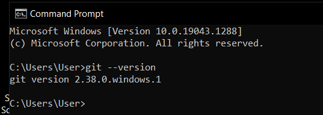
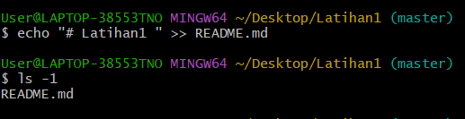

# CARA PENGUNAAN GIT

 ## Instalasi GIT

#### - Download GIT, buka website resminya Git (git-scm-com). 
#### - Kemudian untuk git sesuai dengan arsitektur komputer kita. Kalau menggunakan 64bit, unduh yang 64bit. Begitu juga kalau menggunakan 32bit.
#### - Selamat, Git sudah terinstal di Windows, Untuk mencobanya, silahkan buka CMD atau PowerShell, kemudian ketik perintah
```
git --version
```


#### - Pada saat pertama kali menggunakan git, perlu dilakukan konfigurasi *user.name* dan *user.email*'
#### - Konfigurasi ini bisa dilakukan untuk global repository atau individual repository
#### - Apabila belum dilakukan konfigurasi, akan mengakibatkan terjadi kegagalan saat menjalankan perint globah git commit


#### - Config Global Repository
```
$ git config -- global user.name "nama_user"
```
```
$ git config -- global user.email "nama_user"
```

## Perintah Dasar Git


#### - git init, perintah untuk membuat repository lokal.
#### - gti add, perintah untuk menambahkan file baru, atau perubahan pada file pada staging sebelum proses commit.
#### - git commit, perintah untuk meyimpan perubahan kedalam database git.
#### - git push -u origin master, perintah untuk mengirim perubahan pada repository lokal menuju server repository.
#### - git clone [url], perintah untuk membuat working directory yang diambil dari repository server.
#### - git remote add origin[url], perintah untuk menambahkan remote server/repository server pada lokal repository (*working directoty*)
#### - git pull, perintah untuk mengambil/mendownload perubahan terbaru dari server repository ke lokal repository.

## Membuat Repository Lokal

#### - Buka directory aktif misal : C:\Users\User\Desktop\dlabs_pemograman1 (buka menggunakan Windows Explorer)
#### - Klik kanan pada directory aktif tersebut, dan pilih menu Git Bash. sehingga muncul *git bash command*
#### - Buat directory project praktikum pertama dengan nama Latihan1
```
$ mkdir Latihan1
```
```
$ cd Latihan1
```
#### - Sehingga terbentuk suatu directory baru dibawahnya, selanjutnya masuk kedalam directory tersebut dengan perintah cd (*change directory*).
#### - Directory aktif menjadi : C:\Users\User\Desktop\dlabs_pemograman1\Latihan1

## Membuat Repository Lokal

#### - Jalankan perintah git init, untuk membuat repository lokal.
```
$ git init
```
#### - Repository baru berhasil di inisialisasi, dengan terbentuknya satu directory hidden dengan nama .git
#### - Pada directory tersebut, senua perubahan pada *working directory* akan disimpan.

## Menambahkan File Baru pada Repository

#### - Untuk menambahkan file dapat menggunakan *text editor*, lalu menyimpan filenya pada directory aktif (repository).
#### - Disini kita akan coba buat satu file bernama README.md (text file)
```
$ echo "# Latihan 1 " >> README.md
```
#### - File README.md berhasil dibuat.

#### - Untuk menambahkan file yang baru saja dibuat tersebut gunakan perintah git add.
```
$ git add README.md
```


